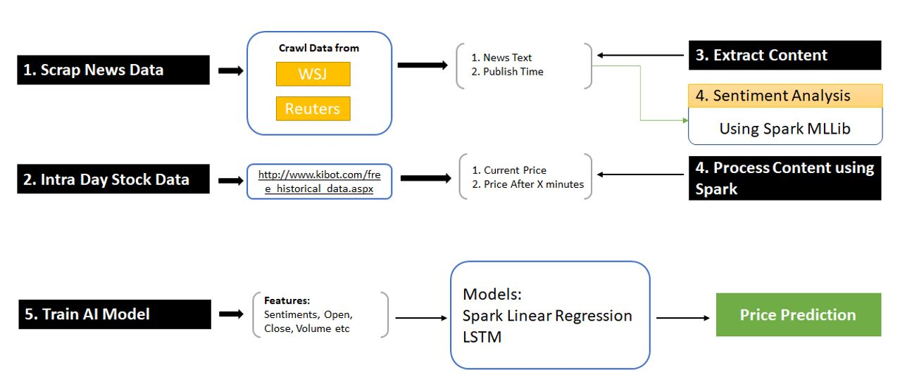
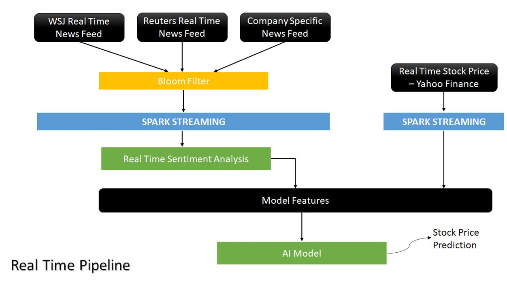

# Real Time Stock Price Prediction using Spark Streaming

In this project, we propose a real-time stock price prediction model based on market trends and historical stock prices.  
We wanted to see if real time market trends and news have any impact on stock prices.
We have combined historical prices with sentiment analysis to build a hybrid model using Apache Spark framework. Used Spark Streaming service to build the model in real-time. 

### Details:

#### Data Source:
- Intra Day Stock Price: We found historical intra day stock prices for IBM from here http://www.kibot.com/free_historical_data.aspx. And we have used Yahoo Finance to get real time prices.
- News Data- Built a scrapper in python to collected archived news from WSJ News and Reuters. Combined this scrapper with spark streaming to get real time market trends and news.

#### Development Pipeline:

#### RealTime Pipeline

